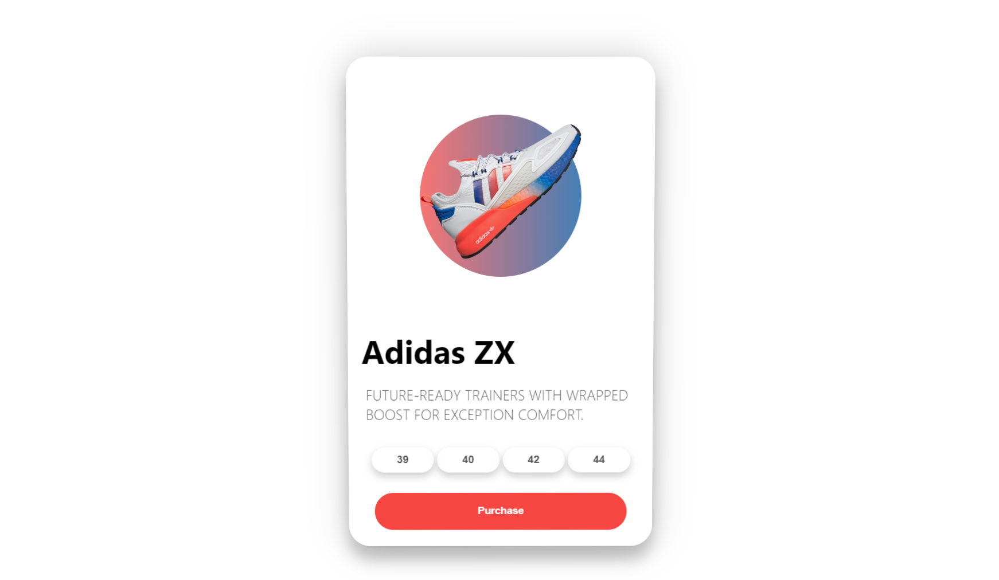

# 3D Card Animation Effect



This repo is a simple showcase of 3D animations with some tranfroms and css effects. You can pretty much use this effect as an drag-ang-drop component.

<hr/>

There are three main things happening basically:

1. When the user moves the mouse inside the container:
```javascript
const handleMouseMove = (e) => {
        let xAxis = (window.innerWidth / 2 - e.pageX) / 25;
        let yAxis = (window.innerHeight / 2 - e.pageY) / 25;

        // setting state
        setTransformedStyle(`rotateY(${xAxis}deg) rotateX(${yAxis}deg)`);
    };
```

2. When the mouse enters the container:
```javascript
const handleMouseEnter = () => {
        // using reacts refs
        card.current.style.transition = 'none';
        title.current.style.transform = 'translateZ(150px)';
        sneaker.current.style.transform = 'translateZ(200px) rotateZ(-45deg)';
        description.current.style.transform = 'translateZ(125px)';
        sizes.current.style.transform = 'translateZ(100px)';
        purchase.current.style.transform = 'translateZ(75px)';
    };
```

3. When mouse leaves the container:
```javascript
const handleMouseLeave = (e) => {
        // react refs
        card.current.style.transition = 'all 0.5s ease';
        card.current.style.transform = `rotateY(0deg) rotateX(0deg)`;
        title.current.style.transform = 'translateZ(0px)';
        sneaker.current.style.transform = 'translateZ(0px) rotateZ(0deg)';
        description.current.style.transform = 'translateZ(0px)';
        sizes.current.style.transform = 'translateZ(0px)';
        purchase.current.style.transform = 'translateZ(0px)';
    };
```


Package.json has 2 following scripts, choose whichever appropriate:
```bash
npm start 
or
npm build
```

### **This project uses Create-React-App, [Click here](https://create-react-app.dev/) to learn more.**